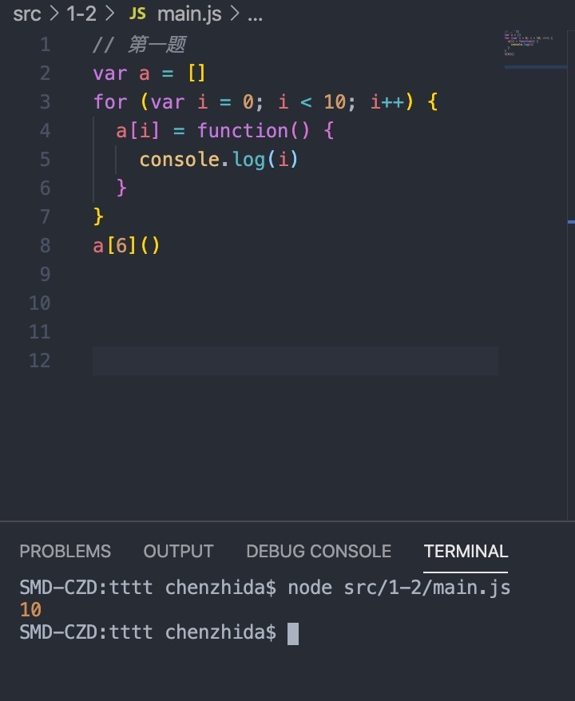
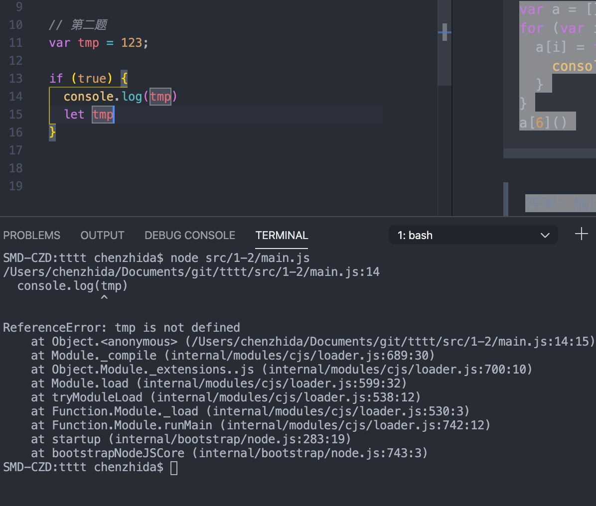
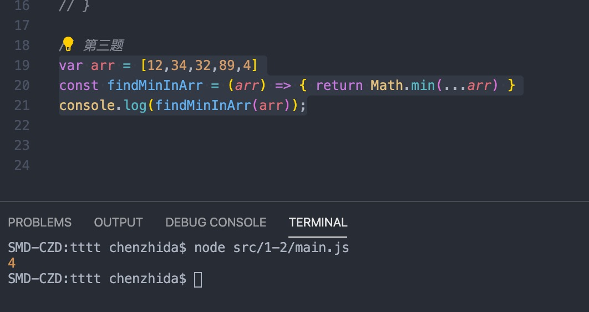
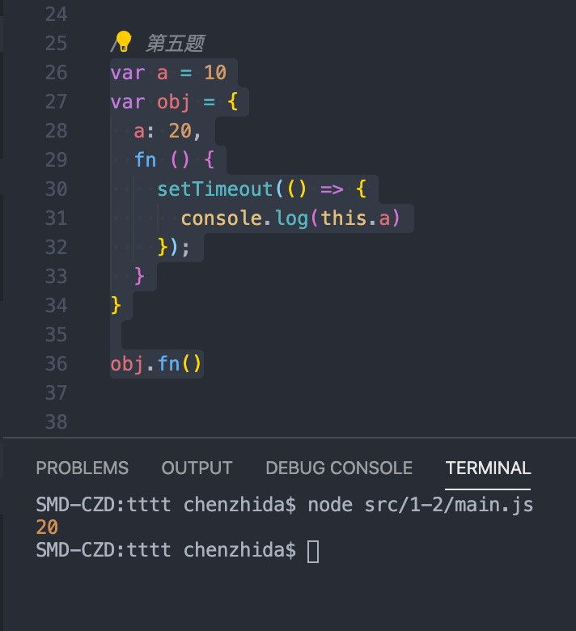

#### 一、请输出下列最终的执行结果，并解释为什么
```` javascript
var a = []
for (var i = 0; i < 10; i++) {
  a[i] = function() {
    console.log(i)
  }
}
a[6]()
````

>答案：输出10。

>原因：该段代码首先在循环体内定义了10个打印i值的function并且存放到对应数组位置，由于循环条件内使用的是var关键字，可看作i是定义在全局作用域上，当循环结束后i=10，并且定义的function自身作用域内没有i变量，通过作用域脸找到了全局作用域下的i,并打印结果10。

>验证：

#### 二、请说出下列最终的执行结果，并解释为什么。

````javascript
var tmp = 123;

if (true) {
  console.log(tmp)
  let tmp
}
````

>答案：抛出错误 tmp is not defined

>原因：let关键字会造成暂时性死区，并let声明的变量不会出现变量提升，所以在执行console.log(tmp)的时候无法在true代码中找到tmp变量，所以抛出错误

>验证：

#### 三、结合ES6新语法，用最简单的的方式找出数组中的最小值
````javascript
var arr = [12,34,32,89,4]
const findMinInArr = (arr) => { return Math.min(...arr) }
console.log(findMinInArr(arr));
````
> 思路：Math.min函数能够获取多个数字中的最小值，但参数形式为(arg1, arg2,....),这时候使用ES6中新增的数据省略号 结构传入的数组

>验证：

#### 四、请详细说明var, let,const三种声明变量的方式之间的具体差别

> let、const都是ES6新增的声明变量的关键字。let主要与var的区别主要体现在ES6中新增的块级作用域概念，let声明的变量只能在其所在块级作用域（可理解成大括号所包起来的）内使用，且会造成暂时性死区，且变量不会出现变量提升的。const与let基本一致，唯一区别是该变量是只读属性，这里的只读属性是指该变量存储的值不可改变，但当变量是引用类型时，存储的值是内入地址，所以还是可以修改变量（引用类型）内的属性和方法。

#### 五、请说出下列代码最终输出的结果，并解释为什么。
````javascript
var a = 10
var obj = {
  a: 20,
  fn () {
    setTimeout(() => {
      console.log(this.a)
    });
  }
}

obj.fn()
````
>答案：20

>原因：this指向问题,fn内的定时器执行函数为箭头函数，即箭头函数内this的指向是根据上下文获得，即fn的this。然后根据非特殊情况下，谁调用该方法，this指向谁，由obj调用的fn(),所以fn内的this指向obj,实际执行console.log(obj.a), 输出20

>验证：

#### 六、简述Symbol类型的用途

>Symbol是ES6新增数据类型，用来表示一个独一无二的值（英文直译既是标志）。出于该特性可以用来解决一下问题 1: 在使用第三方文件时，可能需要拓展第三方文件内抛出的对象，这时可能会造成键名重复问题，可以用Symbol避免；2 可以模拟对象的私有成员；

#### 七、说说什么是浅拷贝，什么是深拷贝

>深浅拷贝主要是出现在对对象进行复制操作方法不同时所出现的差异。当一个变量是应用类型的时候，实际存储的是引用类型的内存地址。如果通过简单的复制操作或者Object.assign方法，其实是复制的引用类型的地址，所以此时如果修改复制的结果，就会修改到改内存地址内的内容，导致源对象也会被修改，这就是是浅拷贝(即只拷贝了引用地址 而不是内部具体的值)。深拷贝则是与浅拷贝对立，通过遍历该对象内的属性，将属性值为基础数据类型直接复制拷贝，对属性值为引用数据类型是则是递归调用上述拷贝方法。所以当深拷贝的时候，修改目标值并不会影响原来的对象，即真正意义的实现复制。

#### 八、请简述TypeScript(一下简称js)和JavaScript(以下简称js)之间的关系

> ts是js的超集，即ts包括了js、类型系统和对es6新特性的支持，ts最终会编译成js代码。避免JS中的类型异常，提高了JS的标率和可靠性

#### 九、请谈谈你所认为的TypeScript优缺点

>优点 1.ts是强类型静态语言，可以减少js的类型异常问题的出现。提高JS开发过程中的可靠性；2.通过类型定义，也方便编辑器更智能的提示，同时也可以更清晰的知道函数调用参数的类型，提高开发效率3.对ES6的天然支持。

>缺点：1.新增了更多的面向对象内类的概念，如抽象类、泛型，增加了前端工作者的学习成本。2.没有js的自由度高，在小型项目内需要谨慎考虑。

#### 十、 描述引用技术的工作远离和优缺点

>工作远离：内部设置一个应用计数器来记录当前对象的引用数，然后判断引用数是否为0，如果为零，则进行垃圾回收。
>优点：1.发现垃圾时立即回收；2.最大限度减少程序暂停，当内存即将爆满的时候，引用计数回立刻去找那些引用计数为0的对象进行垃圾回收，释放内存空间。
>缺点：1.无法回收循环引用的对象；2、时间开销大、需要时刻监控引用对象的修改。 

#### 十一、 描述标记整理算法的工作流程

> 1:遍历所有对象找到活动活动的对象标记;2、执行整理，移动对象的位置，让内存地址产生连续；3、遍历所有对象，清除没有标记的对象，并且将标记阶段的标记抹掉，便于下次GC回收。

#### 十二、描述V8中新生代存储区垃圾回收的流程
>  对新生代存储区划分两个等大的控制，使用空间记录为from空间，空闲空间为to,将所有的活动对象存储到from空间内，当内存使用到一定程度的时候，会触发回收机制，通过标记整理后，将From空间的内容拷贝至to空间内，并且清空from空间。此时就完成from和to的互相转换。